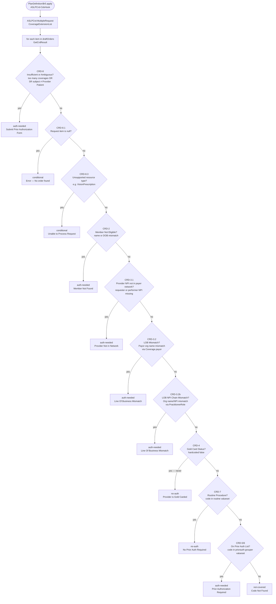

# ASLPCrd-CdsHook — CRD Decision Tree

## Execution Flow

---

## CRD Checks Reference Table

> **Data sources:**
> - **Provider** = inline `Provider Context` Bundle in the `$r5.apply` request parameters
> - **Payer** = live retrieves from `dataEndpoint` (payer FHIR server) scoped to `subject` patient

| Order | CRD | Name | Condition Message | Provider Field | Payer Field | Comparison | pa-needed | covered |
|-------|-----|------|-------------------|---------------|-------------|------------|-----------|---------|
| 1 | **CRD-8** | Subject / Context Validation | "Insufficient or ambiguous data — too many coverages or SR subject does not match Provider Patient" | `SR.subject.reference` → `"Patient/provider-patient-1"` | `Provider Context Bundle: Patient.id.value` → `"provider-patient-1"` | `GetSubjectID(SR) !~ Provider.Patient.id` ⚠️ broken: `Patient/` prefix mismatch | `auth-needed` | `conditional` |
| 2 | **CRD-8.1** | Empty Request | "No order found" | `requestItem is null` | — | null check | `conditional` | `conditional` |
| 3 | **CRD-8.3** | Unsupported Resource Type | "Unable to process request electronically" | `GetResourceType(SR)` | `UnsupportedResourceTypes = {'VisionPrescription'}` | `resourceType in list` | `conditional` | `conditional` |
| 4 | **CRD-2** | Member Eligibility | "Member not found — name or DOB mismatch" | `Provider.Patient.name.family` `Provider.Patient.birthDate` | `Payor.Patient.name.family` `Payor.Patient.birthDate` | family name lists **intersect** AND `days between DOB = 0` | `auth-needed` | `conditional` |
| 5 | **CRD-3.1** | Provider NPI Match | "Provider is not in the network" | SR → `Provider.Practitioners` → `identifier[system=us-npi].value` | `Payor.Practitioners` → `identifier[system=us-npi].value` | provider NPIs **included in** payer NPIs (requester AND performer) | `auth-needed` | `conditional` |
| 6 | **CRD-3.2** | LOB Match (org-level) | "Line of business mismatch" | `Provider.Coverage.payor.reference` → `Provider.Organization.name` | `Payor.Coverage.payor.reference` → `Payor.Organization.name` | `ProviderOrg.name ~ PayorOrg.name` ⚠️ broken: `R = O.id.value` missing `Organization/` prefix | `auth-needed` | `conditional` |
| 7 | **CRD-3.2b** | LOB Match (NPI chain) | "Line of business mismatch via PractitionerRole" | SR requester/performer → `Provider.PractitionerRole` → `organization.reference` → org name/NPI | `Payor.Organization` via provider Coverage | `org.name ~` or `org.getNpi() ~` ⚠️ broken: `PractitionerRole.practitioner.reference` vs `Practitioner.id` prefix | `auth-needed` | `conditional` |
| 8 | **CRD-4** | Gold Card Status | "Provider has gold card — no auth needed" | — | — | hardcoded `false` — never fires | `no-auth` | `covered` |
| 9 | **CRD-7** | Routine Procedure | "No prior auth required — routine procedure" | `SR.code` | valueset `http://terminology.smilecdr.com/cs/routine` | `SR.code in "Routine Procedure Valueset"` | `no-auth` | `covered` |
| 10 | **CRD-5** | On Prior Auth List | "Prior authorization required" | `SR.code` | valueset `http://terminology.smilecdr.com/cs/priorauth-grouper` | `SR.code in "Prior Auth Required for Procedure Grouper"` | `auth-needed` | `conditional` |
| 11 | **CRD-6** | Code Not Found | "Code not recognized — contact payer" | `SR.code` | same valueset — not found | `NOT in` prior auth list | `conditional` | `not-covered` |

### Notes on open bugs (⚠️)

| CRD | Bug | Fix |
|-----|-----|-----|
| CRD-8 | `SR.subject.reference` returns `"Patient/provider-patient-1"` but comparison is against bare `"provider-patient-1"` | Strip `Patient/` prefix in `GetSubjectID()` or at comparison site |
| CRD-3.2 | `R = O.id.value` where `R` is `"Organization/provider-payorganization-1"` and `O.id.value` is `"provider-payorganization-1"` | Change to `R = 'Organization/' + O.id.value` in `ASLPCrdOrderLOBMatchLogic.cql:51` |
| CRD-3.2b | `PractitionerRole.practitioner.reference.value` is `"Practitioner/payer-practitioner-pp2"` compared against `Practitioner.id.value` which is `"payer-practitioner-pp2"` | Change to `'Practitioner/' + RequesterPractitioner.id.value` in `ASLPCrdProviderNpiMatchLogic.cql:147` |
